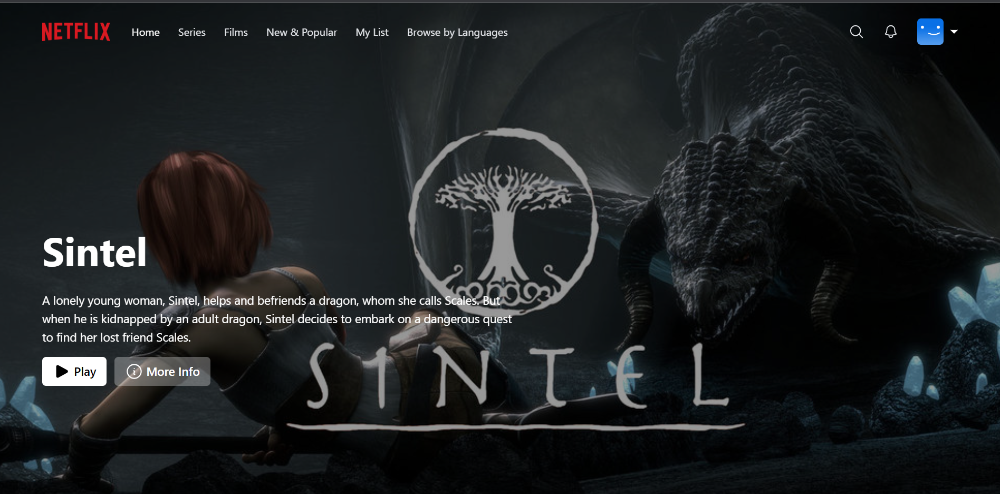
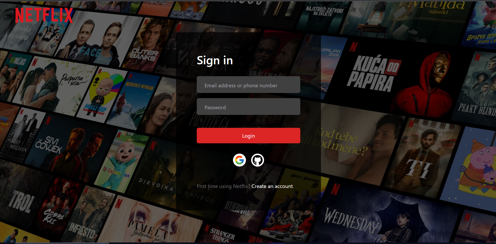
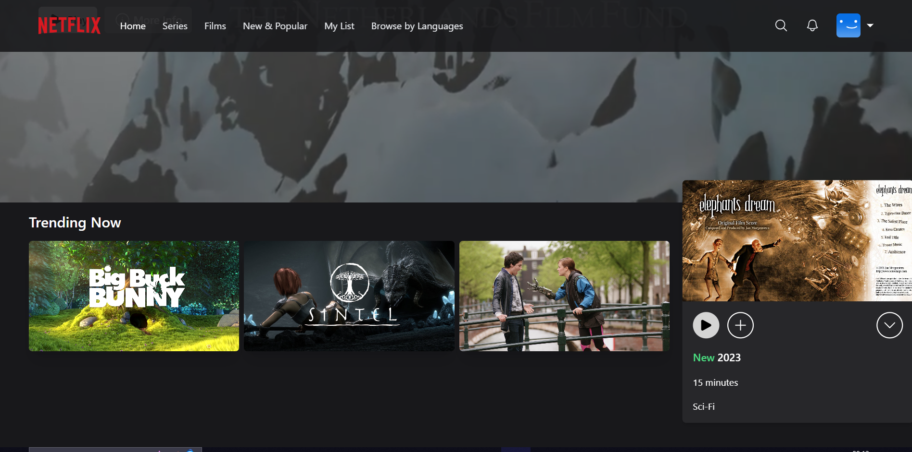
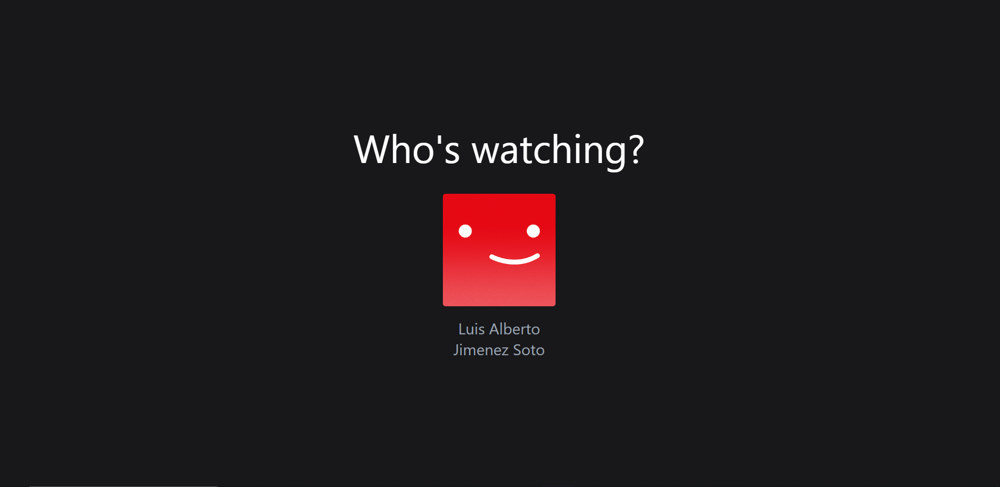
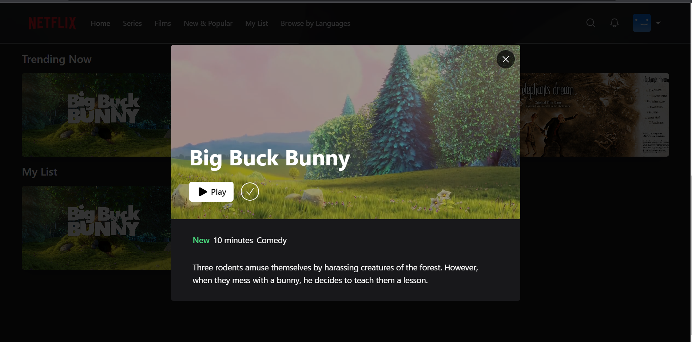
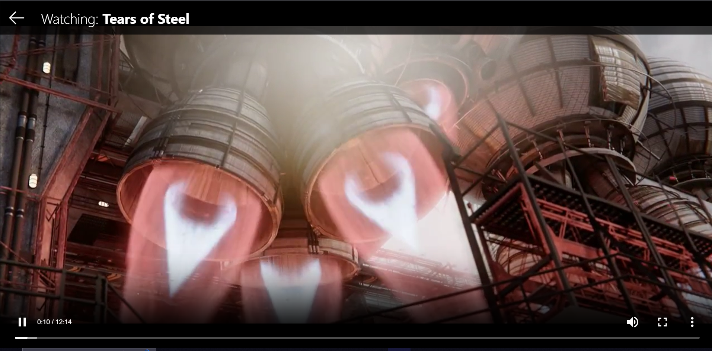

# Building a Fullstack Netflix Clone with React, NextJS, TailwindCSS & Prisma

Este es un repositorio para un FullStack Netflix Clone usando React, NextJS, TailwindCSS & Prisma, sigueindo el tutorial de [**Code With Antonio**](https://www.codewithantonio.com/)

Features:

- Environment, Typescript, NextJS Setup
- MongoDB & Prisma connect, Database creation
- Authentication with NextAuth, Google & Github Login
- Full responsiveness on all pages
- Cookie based authentication
- API and Controllers creation
- Detail-oriented effects and animations using TailwindCSS
- React SWR data fetching
- Zustand state management

Images:

